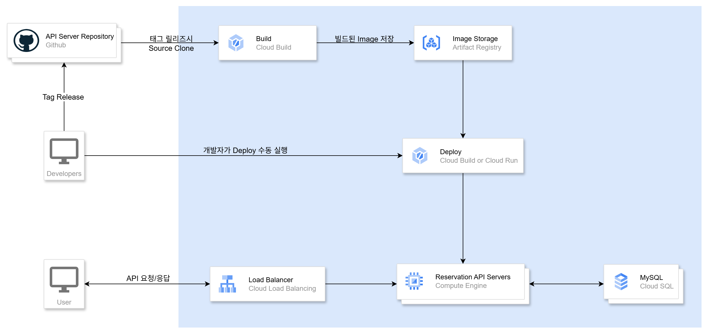
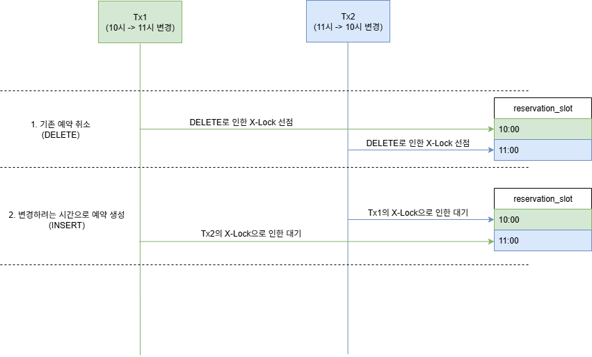

# 회의실 예약 시스템

본 프로젝트는 사내 회의실 예약 서비스를 구현한 SpringBoot 애플리케이션입니다.

## 프로젝트 개요

### 사용 기술 스택
- **Language**: Java 17
- **Framework**: Spring Boot 3.5.5
- **Database**: MySQL 8.0
- **Dependencies**:
  - Spring Data JPA
  - OpenAPI (Swagger)
  - TestContainers
  - Lombok
- **Build Tool**: Gradle
- **Container**: Docker Compose

## 실행 방법

### 1. Docker Compose를 이용하여 실행

```bash
# 실행
docker compose up --force-recreate

# 종료
docker compose down
```
실행중인 서버는 `http://localhost:8080`으로 접근 가능합니다.

### 2. Swagger UI 접속 방법

서버 실행 후 아래 URL로 접속할 수 있습니다.
```
http://localhost:8080/docs
```

## 테스트 실행 방법
테스트는 TestContainers를 사용하여 MySQL 환경에서 실행됩니다.
```bash
./gradlew test
```


## 프로젝트 구조

**Layered Architecture 기반 레이어 구조**
- **API Layer**: HTTP 요청/응답 처리, 입력 검증
- **Application Layer**: 여러 Domain Service를 호출하여 하나의 API 유즈케이스를 처리하는 계층
- **Domain Layer**
    - **Domain Service**: 도메인 단위의 비즈니스 로직을 처리하고, DB 저장 같은 인프라 작업까지 담당
    - **Domain Model**: 엔티티, 핵심 도메인 규칙 책임

```
src/
├── main/java/com/wiseaiassignment/
│   ├── api/                           # Presentation Layer
│   │   ├── common/                    # 공통 API 컴포넌트
│   │   ├── meetingroom/               # 회의실 API
│   │   │   ├── dto/                   
│   │   │   ├── MeetingRoomController.java
│   │   │   └── MeetingRoomApiSpec.java
│   │   ├── reservation/               # 예약 API
│   │   └── user/                      # 사용자 API
│   │
│   ├── application/                   # Application Layer
│   │   ├── meetingroom/               # 회의실 애플리케이션 서비스
│   │   │   ├── dto/                   # Command/Result DTO
│   │   │   └── MeetingRoomAppService.java
│   │   ├── reservation/               # 예약 애플리케이션 서비스
│   │   └── user/                      # 사용자 애플리케이션 서비스
│   │
│   └── domain/                        # Domain Layer
│       ├── common/                    # 공통 도메인 컴포넌트
│       │   ├── exception/             # 도메인 예외
│       │   └── lib/                   # 도메인 라이브러리
│       ├── meetingroom/               # 회의실 도메인
│       │   ├── model/                 # 도메인 모델
│       │   ├── repository/            # 레포지토리 인터페이스
│       │   └── MeetingRoomService.java
│       ├── notification/              # 알림 도메인
│       ├── reservation/               # 예약 도메인
│       └── user/                      # 사용자 도메인
│
└── test/java/com/wiseaiassignment/
    ├── api/                           # API 레이어 테스트 (E2E)
    ├── domain/                        # 도메인 레이어 테스트
    └── helper/                        
        ├── config/                    # TestContainers 설정 등
        └── util/                      # DB 초기화 유틸 등
```

## 클라우드 아키텍처 다이어그램

### GCP 기반 인프라 아키텍처



## 예약 동시성 제어를 위한 전략

### 1. 예약 생성 시 회의실 단위 비관적 락
- `SELECT ... FOR UPDATE`를 사용하여 회의실 단위로 락을 획득
- 예약 생성 시점에 동일 회의실에 대한 동시 접근 방지
- **동시성 수준은 회의실 단위로 제한됨**
### 2. daily 단위로 MySQL 네임드 락 사용
- `GET_LOCK(회의실ID_날짜, 타임아웃)`을 사용하여 회의실+날짜 단위로 네임드락 획득
- 1번 방식보다 성능은 상대적으로 높지만, 동시성 수준은 회의실+날짜 단위로 제한됨
- **동시성 수준은 회의실 + 일자 단위로 제한됨**
### 3. ReservationSlot을 통한 시간별 Slot 관리
   - 예약 시간을 30분 단위의 row로 관리하는 방식
   - 예약 생성/변경 시점에 슬롯 단위로 시간 겹침 여부 확인
   - 예약 최소 시간이 작아질수록 row 수가 증가하여 많은 INSERT/DELETE로 인한 성능 저하 우려
   - 예약 단위 시간을 변경할 경우 완전히 배포될 때 까지는 예약 슬롯을 기존 단위시간과 새로운 단위 시간 동시에 사용해야함
### 4. 낙관적 락(@Version) 적용을 통한 시간별 Bucket 관리
   - 예약 버킷 엔티티에 `@Version` 필드를 추가하여 낙관적 락 적용
   - 버킷은 30분 단위로 내림하여 관리 (예: 10:10 예약 → 10:00 버킷, 10:45 예약 → 10:30 버킷)
   - 예약 생성시 버킷의 버전을 증가시켜 동시성 제어
   - 예약 최소 시간이 작아질수록 row 수가 증가하여 성능 저하 우려 (slot처럼 많은 INSERT/DELETE는 아님)
   - 예약 단위 시간을 변경할 경우 완전히 배포될 때 까지는 예약 슬롯을 기존 단위시간과 새로운 단위 시간 동시에 사용해야함

### 선택한 전략
**3번의 ReservationSlot을 이용하여 슬롯 단위로 동시성을 제어하기로 하였습니다.**  
Application에서 Lock을 직접 제어하기보다는 DB의 제약조건을 통해 Lock 점유시간을 최소화하는 방향으로 설계하였습니다.

## 교착 상태 (Deadlock) 관련 고려사항

### **시나리오: 예약 변경(예약 취소 -> 새로운 예약 생성) 시 교차 락 대기**
예약 변경시 기존 예약을 취소하고 새로운 예약을 추가하게 되면 데드락이 발생할 수 있습니다.


트랜잭션이 커밋되기 전까지는 Lock은 해제되지 않으므로, 다음과 같은 상황이 발생할 수 있습니다.
```
Transaction A (예약1 -> 예약2): 10시 예약 취소 → 11시 예약 추가
Transaction B (예약2 -> 예약1): 11시 예약 취소 → 10시 예약 추가

락 획득 순서:
Transaction A: 10시 예약 X-Lock 보유 → 11시 예약 추가를 위한 락 대기
Transaction B: 11시 예약 X-Lock 보유 → 10시 예약 추가를 위한 락 대기
→ 순환 대기로 인한 데드락 발생
```

### 실제 구현 시나리오
기존 예약이 둘다 commit된 상태로 존재하기 때문에 존재 여부를 확인하는 것만으로도 충분하다고 생각하였습니다.
```
Transaction A (10시 -> 11시): 11시 예약이 존재하는지 확인 → 10시 예약 slot 삭제 -> 11시 예약 slot 추가 -> 예약 시간 변경
Transaction B (11시 -> 10시): 10시 예약이 존재하는지 확인 → 11시 예약 slot 삭제 -> 10시 예약 slot 추가 -> 예약 시간 변경
```

## 예약 생성시 시간이 겹칠 경우 slot에 대한 Lock 점유 순서
10\~11시 예약과 10:30\~11:30 예약을 동시에 생성하게 되면 slot에 대한 lock을 점유하기 위해 경쟁 상태에 놓이게 될 수 있습니다.
하지만 데드락은 발생하지 않습니다.
```
시점1
- TxA (10:00 ~ 11:00) : 10:00 slot X-Lock 점유
- TxB (10:30 ~ 11:30) : 10:30 slot X-Lock 점유

시점2
- TxA (10:00 ~ 11:00) : 10:30 slot X-Lock 대기
- TxB (10:30 ~ 11:30) : 11:00 slot X-Lock 점유

시점3
- TxA (10:00 ~ 11:00) : 10:30 slot X-Lock 대기
- TxB (10:30 ~ 11:30) : 예약 생성 완료

시점4
- TxA (10:00 ~ 11:00) : 10:30 slot 데이터가 이미 존재하므로 무결성 위반 예외 발생 -> 실패
```
인덱싱이 되어 있는 컬럼에 한해서 lock은 인덱스 정렬 순서대로 점유되기 때문에 해당 시나리오에서 교착 상태는 발생하지 않습니다.
